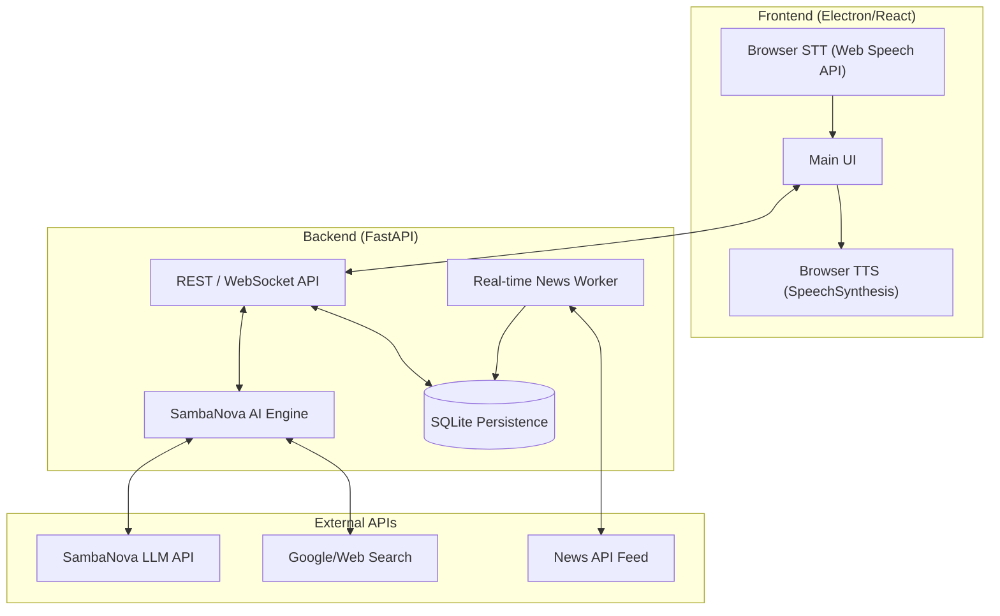

# KYRA System Design Document

## 1. Executive Summary
KYRA (Knowledgeable Yet Responsive Assistant) is a server-grade AI virtual assistant designed for high-performance voice and vision interactions. This document outlines the technical architecture, data flow, and integration strategies.

## 2. System Architecture
The system follows a decoupled Client-Server architecture with a React-based Electron frontend and a FastAPI backend.

## 3. Data Flow
1. **User Input**: Voice (STT) or Text is captured by the Frontend.
2. **Contextual Processing**: Input is sent to the Backend via WebSocket or REST.
3. **Intelligence**: The `SambaNovaEngine` retrieves conversation history from `SQLite` and determines if a search is needed.
4. **Execution**: If `<SEARCH>` is detected, the system fetches live data.
5. **Response**: The final response is sent to the Frontend.
6. **Voice Synthesis**: The Frontend speaks the response using native `SpeechSynthesis`.

## 4. Database Schema

### 4.1 Relational (SQLite) - Conversation & Logs
- **Table: `messages`**
    - `id` (UUID, Primary Key)
    - `user_id` (String)
    - `role` (user/assistant)
    - `content` (Text)
    - `timestamp` (DateTime)
- **Table: `news_feed`**
    - `id` (Integer, PK)
    - `title` (String)
    - `content` (Text)
    - `source` (String)
    - `published_at` (DateTime)

### 4.2 NoSQL (JSON-based) - User Preferences
- **File: `user_settings.json`**
    - `theme`: dark/light
    - `voice_enabled`: boolean
    - `preferred_language`: en-IN
    - `learned_facts`: List of strings

## 5. Integration with Language Model
Integration is handled via the OpenAI-compatible `SambaNova` API. KYRA provides a `SYSTEM_PROMPT` that defines her persona and capabilities (Search, Code, Emotional Intelligence).
